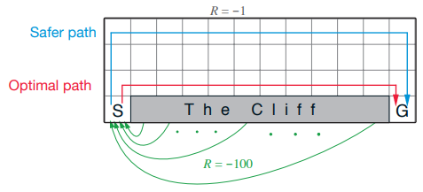
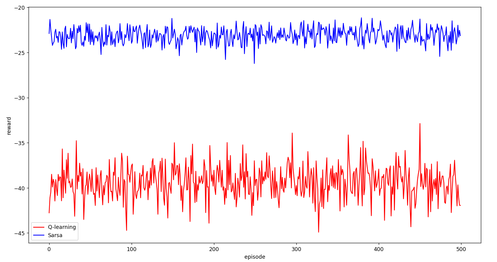
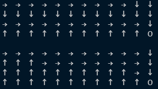
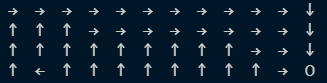
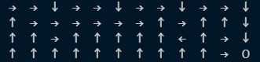
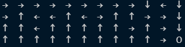
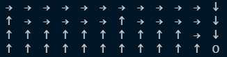
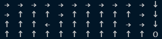
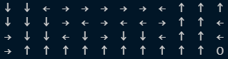

# Cliff problem

## Introduction

Q-learning, Sarsa, n-step Sarsa, Sarsa(lambda) in a 4x12 grid world cliff walking problem in *Decision Making Under Uncertainty - Theory and Application*.

> A  undiscounted, episodic task, with start and goal states, and the usual actions causing movement up, down,
> right, and left. Reward is -1 on all transitions except those into the region marked “The Cliff.” Stepping into this region incurs a reward of -100 and sends the agent instantly back to the start.

## How to run

- Set the `mode` in `main` as `Qlearning_Sarsa_comparison / Nstep_Sarsa / Sarsa_Lambda` ro run different tasks.
- Set `episode_num` 与 `rounds` in line 189, 190 to determine the number of episodes and iterations.

## Results

### Comparison between Q-learning and Sarsa 

The figure below shows the reward when `rounds = 500, episode_num = 500, learning_rate = 0.1, gamma = 1, epsilon = 0.1`

The chosen path in Q-learning and Sarsa.

### n-step Sarsa

The chosen path in n-step Sarsa when `rounds = 1000, n = 1,3,5, learning_rate = 0.1, gamma = 1, epsilon = 0.1`. As we can see, when `n = 1`, the chosen path is the same as Sarsa.

### Sarsa(lambda)

The chosen path in Sarsa(lambda) when `rounds = 1000, Lambda = 0,0.5,1, learning_rate = 0.1, gamma = 1, epsilon = 0.1`

